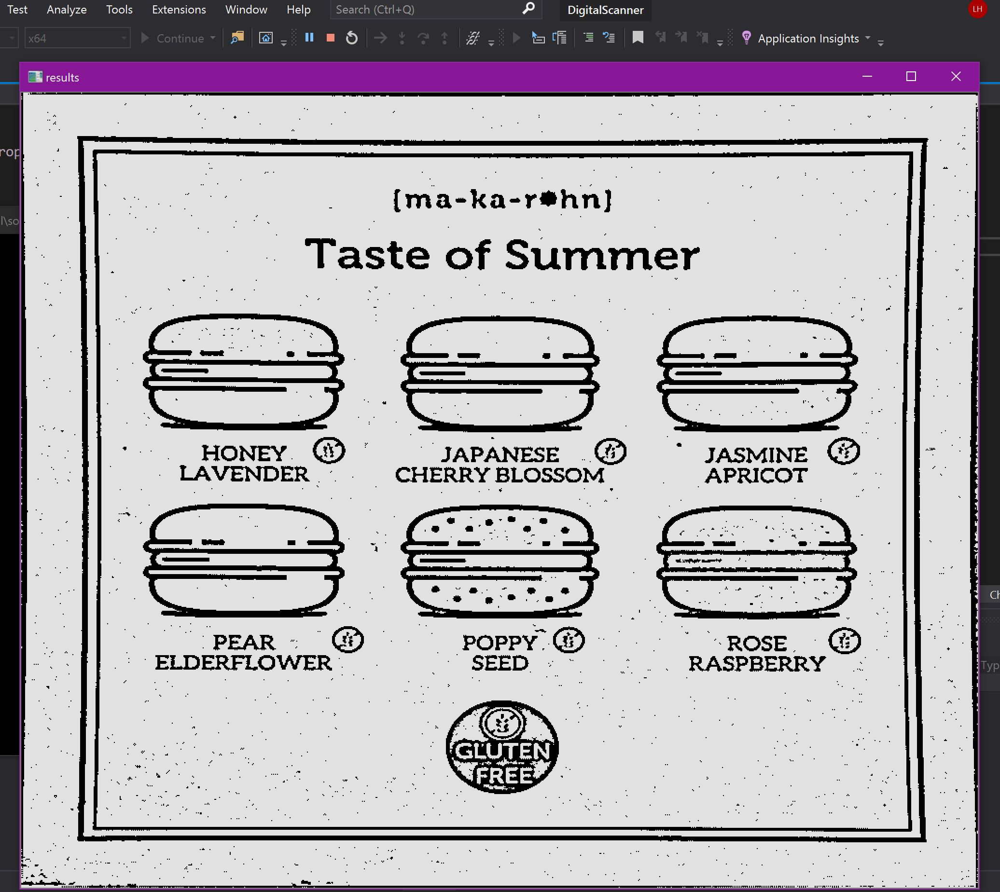

# Digital-Scanner
A Console app that digitally scans images using opencvSharp and Numpy.NET

# How to Get Started locally 
- Clone this repo
- set Build to x64
- Run Application 

# Example Output

## Before the scan

## After 

